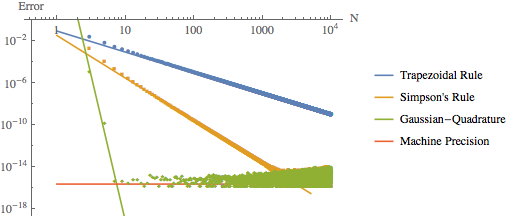

#PH 4433/6433 Homework 2

Mikhail Gaerlan  
2 September 2015

##[Home](hw2.html)

---
##Introduction

To find the optimum N for the Trapezoid Rule, Simpson's Rule, and Gaussian-Quadrature.

---
##Code

1. [Double-precision](double/integdouble.f95)
2. [Single-precision](single/integsingle.f95)

---
##Results

1. [Double-Precision Data](double/integdouble.dat)  

2. [Single-Precision Data](single/integsingle.dat)  

---
##Discussion
The actual optimum N is on the same order as the calculated values. The regions of N where approximation or roundoff error dominate are very clear from the graphs.

###Double-Precision
a.  
Theoretical:  
Trapezoidal Rule  
$\displaystyle{N _{opt}=\left(\frac{4}{\epsilon _m}\right)^{2/5}=\left(\frac{4}{2.220445\times10^{-16}}\right)^{2/5}=3\,178\,688,\qquad \epsilon _{tot}=\frac{1}{N^2}+\sqrt{N}\;\epsilon _m=4.948507\times10^{-13}}$  
Simpson's Rule  
$\displaystyle{N _{opt}=\left(\frac{8}{\epsilon _m}\right)^{2/9}=\left(\frac{8}{2.220445\times10^{-16}}\right)^{2/9}=4\,778,\qquad \epsilon _{tot}=\frac{1}{N^4}+\sqrt{N}\;\epsilon _m=1.726714\times10^{-14}}$  

Actual:  
Simpson's Rule  
$\displaystyle{N _{opt}\sim1000,\qquad\epsilon _{tot}\sim10^{-14}}$  
Gaussian-Quadrature  
$\displaystyle{N _{opt}\sim7,\qquad\epsilon _{tot}\sim10^{-16}}$  

b.  
Linear Fits:  
Trapezoidal Rule  
$\displaystyle{\epsilon _{tot}=e^{-2.529136-2.005978\cdot\ln(N)}}$  
Simpson's Rule  
$\displaystyle{\epsilon _{tot}=e^{-3.496612-4.063054\cdot\ln(N)}}$  
Gaussian-Quadrature  
$\displaystyle{\epsilon _{tot}=e^{19.616713-27.749397\cdot\ln(N)}}$  

###Single-Precision
a.  
Theoretical:  
Trapezoidal Rule:  
$\displaystyle{N _{opt}=\left(\frac{4}{\epsilon _m}\right)^{2/5}=\left(\frac{4}{1.192093\times10^{-16}}\right)^{2/5}=1\,024,\qquad \epsilon _{tot}=\frac{1}{N^2}+\sqrt{N}\;\epsilon _m=4.768372\times10^{-6}}$  
Simpson's Rule:  
$\displaystyle{N _{opt}=\left(\frac{8}{\epsilon _m}\right)^{2/9}=\left(\frac{8}{1.192093\times10^{-16}}\right)^{2/9}=55,\qquad \epsilon _{tot}=\frac{1}{N^2}+\sqrt{N}\;\epsilon _m=9.933558\times10^{-7}}$  

Actual:  
Trapezoidal Rule  
$\displaystyle{N _{opt}\sim100,\qquad\epsilon _{tot}\sim10^{-6}}$  
Simpson's Rule  
$\displaystyle{N _{opt}\sim10,\qquad\epsilon _{tot}\sim10^{-7}}$  
Gaussian-Quadrature  
$\displaystyle{N _{opt}\sim5,\qquad\epsilon _{tot}\sim10^{-7}}$  

b.  
Linear Fits:  
Trapezoidal Rule  
$\displaystyle{\epsilon _{tot}=e^{-2.245795-2.060970\cdot\ln(N)}}$  
Simpson's Rule  
$\displaystyle{\epsilon _{tot}=e^{-1.655109-4.730879\cdot\ln(N)}}$  
Gaussian-Quadrature  
$\displaystyle{\epsilon _{tot}=e^{-4.964896-6.138091\cdot\ln(N)}}$  
