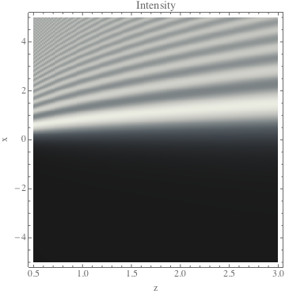
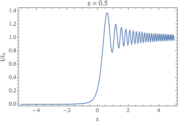
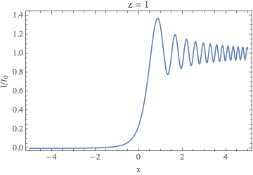
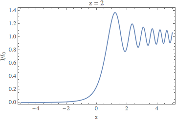

#PH 4433/6433 Homework 3, Problem 1

Mikhail Gaerlan  
16 September 2015

##[Home](../hw3.html)

---
##Introduction
When a plane wave is partially blocked by a straight edge, the intensity of of the wave at a point (*x*, *z*) is given by  

$\displaystyle{I=\frac{I _0}{8}\left([2C(u)+1]^2+[2S(u)+1]^2\right)}$  
$\displaystyle{u=x\sqrt{\frac{2}{\lambda z}}\quad C(u)=\int _0^u\cos\left(\frac{1}{2}\pi t^2\right)dt\quad S(u)=\int _0^u\sin\left(\frac{1}{2}\pi t^2\right).}$

---
##[Code](hw3-1.f90)

---
##[Results](hw3-1.txt)

  

---
##Discussion

A value of *N* = 100 was found to obtain accurate results.
