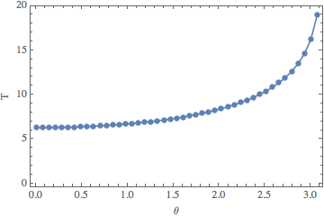
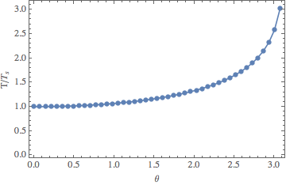

#PH 4433/6433 Homework 3, Problem 3

Mikhail Gaerlan  
16 September 2015

##[Home](../hw3.html)

---
##Introduction

Calculate the period of a plane pendulum using  
$\displaystyle{T=2\sqrt{\frac{L}{g}}\int^1 _{-1}\frac{dx}{\sqrt{1-x^2}\sqrt{1-k^2x^2}}\text{ where } k=\sin(\theta _0/2).}$  
The integral can be estimated using Gauss-Chebyshev quadrature using  
$\displaystyle{S=\int^1 _{-1}\frac{F(x)}{\sqrt{1-x^2}}\approx\sum^N _{j=1}W _jF(x _j)\text{ where }x _j=\cos\left(\frac{\pi\left(j-\frac{1}{2}\right)}{N}\right)},\;W _j=\frac{\pi}{N}.}$

---
##[Code](hw3-3.f90)

---
##[Results](hw3-3.txt)

---
##Discussion
$\displaystyle{F(x)=\frac{2}{\sqrt{1-\sin^2(\theta _0/2)x^2}}}$  
$\text{When }\theta _0<15^\circ\text{, } T/T _s \approx 1.00$  
$\text{The required }N\text{ increases as }\theta _0\text{ increases.}$
