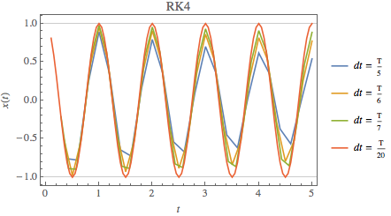
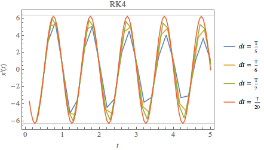
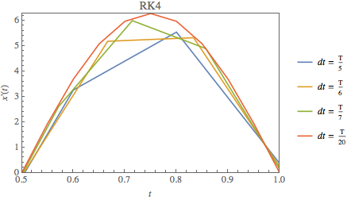
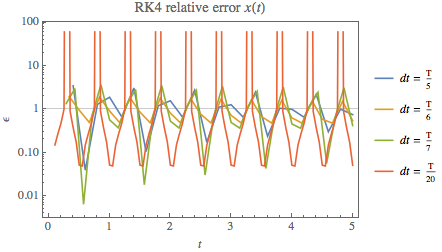
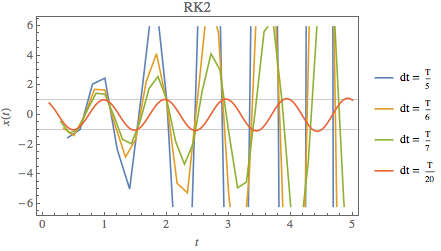
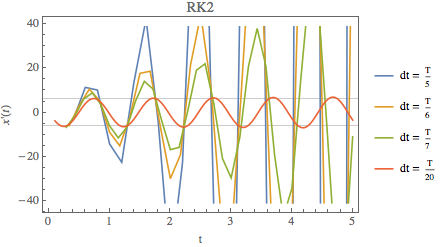
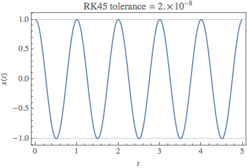
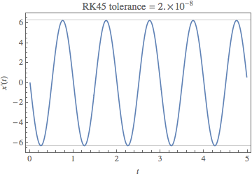
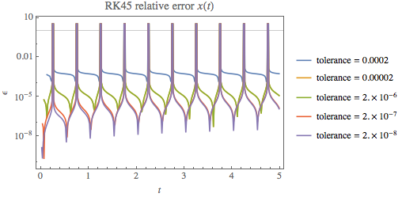

#PH 4433/6433 Homework 4, Problem 1

Mikhail Gaerlan  
30 September 2015

##[Home](../hw4.html)

---
##Introduction

The solution to the ordinary differential equation  
$\displaystyle{m\frac{d^2x}{dt^2}=-kx^{p-1}}$  
when *p* = 2 is simple harmonic motion with the equation  
$\displaystyle{x(t)=A\sin\left(\omega _0t+\phi\right),\;\omega _0=\sqrt{k/m}}$  
This ODE can be solved numerically using various Runge-Kutta methods.

---
##Code

RK4 & RK2

 1. [Main](main.f90)
 2. [Deriv](deriv.f90)
 3. [RK4 & RK2](rk4.f90)

[RK45](rk45-rtc.f90)

---
##Results

###RK4

  

  

###RK4

  

###RK4

  

---
##Discussion

For the RK4 and RK2 method, the error increases as the step size increases.

For the RK45 method, the error increases as the tolerance increases.

For all methods, the error generally increases with time. Also, as the function approaches zero, the relative error becomes skewed when dividing by a number close to zero resulting in asymptotic behavior at the zeros of the function.
