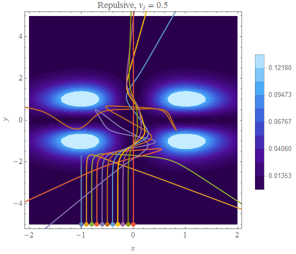
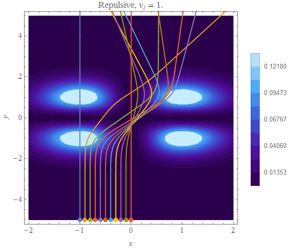
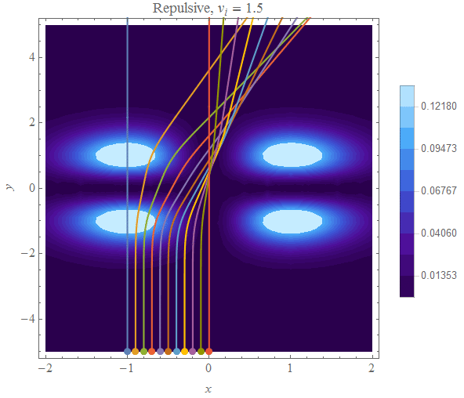
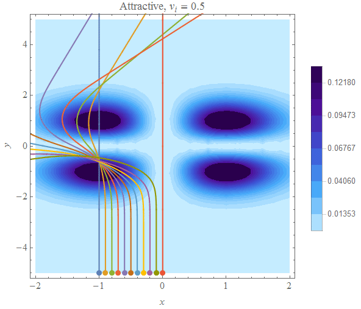
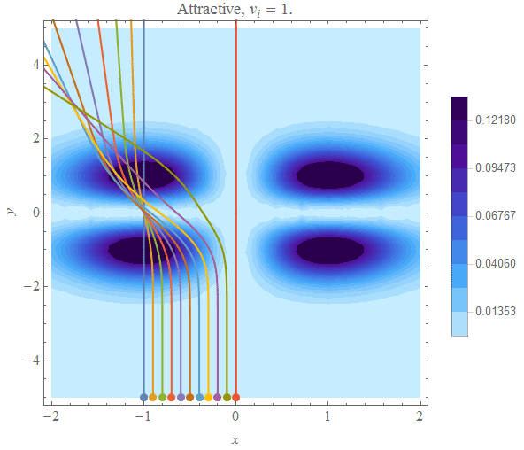
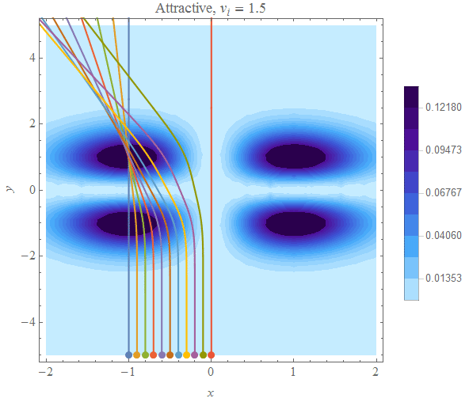
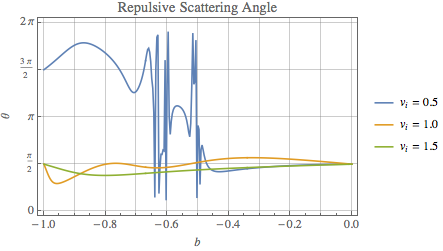
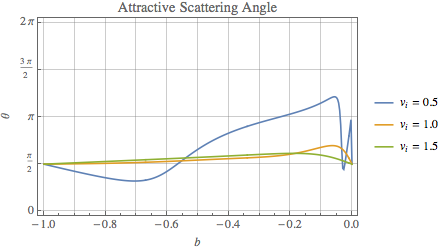

#PH 4433/6433 Homework 4, Problem 2

Mikhail Gaerlan  
30 September 2015

##[Home](../hw4.html)

---
##Introduction

A potential field is given by the equation  
$\displaystyle{V(x,y)=x^2y^2e^{-\left(x^2+y^2\right)}.}$  
The path of a particle interacting with this field can expressed by a system of ODE's.  
By using numerical methods, the path of of a particle can be plotted in the potential field.

---
##Code

Repulsive

 1. [Main](repulsive/main.f90)
 2. [Deriv](repulsive/deriv.f90)
 3. [RK4](repulsive/rk4.f90)

Attractive

 1. [Main](attractive/main.f90)
 2. [Deriv](attractive/deriv.f90)
 3. [RK4](attractive/rk4.f90)

---
##Results

The lines represent the path of the particles. The color of the background represents the strength of the potential field.

---
##Discussion

$\displaystyle{\text{For all values of }b\text{ at both }t=0\text{ and }t\gg t _0\text{, }KE\gg PE\text{ and }KE _{t=0}=KE _{t\gg t _0}\Rightarrow E\approx KE\text{ and thus }E _{before}=E _{after}\text{.}}$  

$\displaystyle{\text{The scattering angles for }b=-1\text{ and }b=0\text{ are }\frac{\pi}{2}\text{ (except repulsive, }v _i=0.5\text{), which make sense since the particles}}$  
$\displaystyle{\text{are entering perpendicular to the field and will continue to move in straight lines. For repulsive }v _i=0.5\text{, the}}$  
$\displaystyle{\text{particle does not have enough kinetic energy to overcome the field and thus goes back in the opposite direction.}}$  
$\diaplsystyle{\text{For all other values of }b\text{, the scattering angle is seemingly random for low }v _i\text{. For higher }v _i\text{, most of the}}$  
$\displaystyle{\text{scattering angles are around }\frac{\pi}{2}\text{ since most of the particles pass through the field mostly unchanged.}}$
