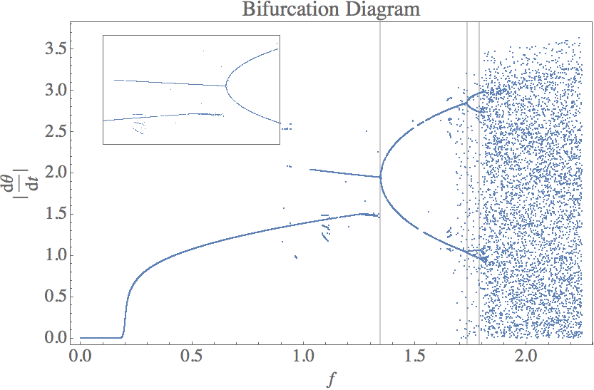

#PH 4433/6433 Homework 5

Mikhail Gaerlan  
9 October 2015

##[Home](hw5.html)

---

##Introduction

The equation of motion for a damped, driven pendulum is given by the equation  
$\displaystyle{\frac{d^2\theta}{dt^2}=-\alpha\frac{d\theta}{dt}-\left(\omega _0^2+f\cos(\omega t)\right)\sin\theta}$

---
##Code

1. [main.f90](main.f90)
2. [deriv.f90](deriv.f90)
3. [rk4.f90](rk4.f90)

---
##Results

---
##Discussion

$\displaystyle{f _1\approx1.345,\;f _2\approx1.735,\;f _3\approx1.790}$  
The Feigenbaum constant is approximated to be  
$\displaystyle{\lim _{n\to\infty}\frac{f _{n-1}-f _{n-2}}{f _{n}-f _{n-1}}\approx\frac{f _2-f _1}{f _3-f _2}\approx\frac{1.735-1.345}{1.790-1.735}\approx7.09}$
