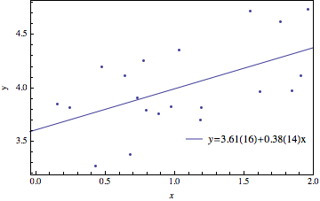

#PH 4433/6433 Homework 7, Problem 1

Mikhail Gaerlan  
28 October 2015

##[Home](../hw7.html)

---
##Introduction

Linear least-square fitting  
$\displaystyle{A _{i1} = \frac{1}{\sigma},\;A _{i2} = \frac{x _i}{\sigma},\;b _i = \frac{y _i}{\sigma}}$  
$\alpha=A^TA,\;\beta=A^Tb$  
$a = \alpha^{-1}\beta$  
$c = \alpha^{-1},\;\sigma _{a _1} = c _{1,1},\;\sigma _{a _2} = c _{2,2}$

---
##[Code](hw7-1.f90)

---
##[Results](hw7-1.txt)

---
##Discussion

The parameters calculated by the method in class matches the parameters given by Mathematica. However, the uncertainties calculated slightly differ but are within the same order of magnitude.
