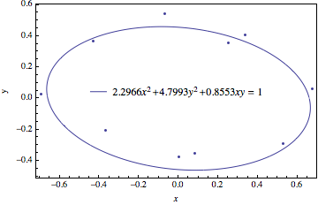

#PH 4433/6433 Homework 7, Problem 2

Mikhail Gaerlan  
28 October 2015

##[Home](../hw7.html)

---

##Introduction

An ellipse can be defined by the equation  
$a _1x^2+a _2y^2+a _3xy=1$  
where <em>a</em>1, <em>a</em>2, and <em>a</em>3 can be fit to a set of data using the least-squares method. The equations can be parametrized by the equations  
$\displaystyle{x=\rho\cos(\theta)}$  
$\displaystyle{y=\rho\sin(\theta)}$  
$\displaystyle{\frac{1}{\rho^2}=a _1\cos^2(\theta)+a _2\sin^2(\theta)+a _3\cos(\theta)\sin(\theta)}$  

---
##[Code](hw7-2.f90)

---
##[Results](hw7-2.txt)

---
##Discussion

$A _{i1} = x _i^2,\;A _{i2} = y _i^2,\;A _{i3} = x _iy _i,\;b _i = 1.00$
