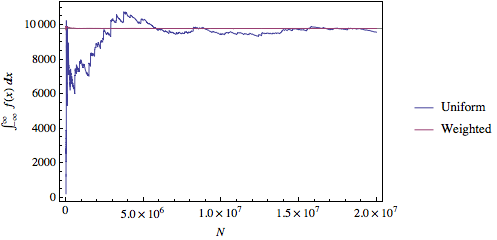
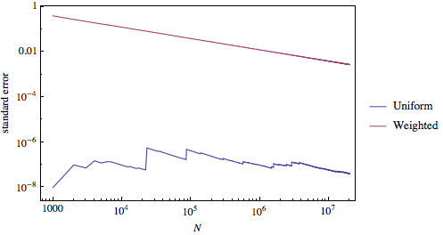
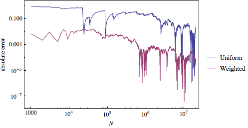

#PH 4433/6433 Homework 8, Problem 1

Mikhail Gaerlan  
9 November 2015

##[Home](../hw8.html)

---
##Introduction

The following 10-dimensional integral can be calculated using simple Monte Carlo integration, the "Stone throwing" method:  
$\displaystyle{\int _{-\infty}^\infty dx _1\int _{-\infty}^\infty dx _2\cdots\int _{-\infty}^\infty dx _{10}\;e^{-\frac{1}{2}(x _1^2+x _2^2+\cdots+x _{10}^2)}}$  
The method may converge faster with importance sampling.

---
##[Code](hw8-1.f90)

---
##Results

---
##Discussion

The error decreases with increased $N$. The "Stone throwing" method converges much, much faster with importance sampling than without. Also, the error for the same $N$ with importance sampling is much smaller than without.
