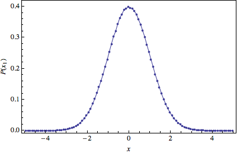

#PH 4433/6433 Homework 8, Problem 2

Mikhail Gaerlan  
9 November 2015

##[Home](../hw8.html)

---
##Introduction

The Metropolis algorithm can be used to generate a probabilty function as described by the following  
$\displaystyle{P(\vec{x})\propto e^{-\frac{1}{2}(x _1^2+x _2^2+\cdots+x _{10}^2)}}$  

---
##[Code](hw8-2.f90)

---
##[Results](hw8-2.txt)

---
##Discussion

The expectation values are very close to the exact results.

