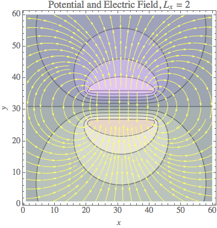
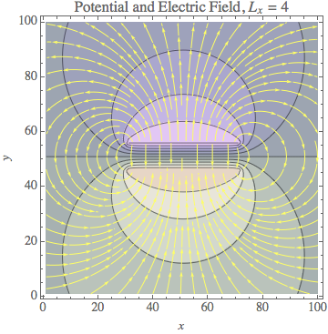
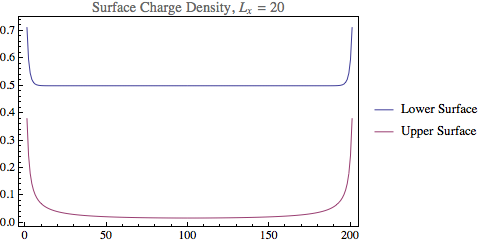

#PH 4433/6433 Homework 9

Mikhail Gaerlan  
23 November 2015

##[Home](hw9.html)

---

##Introduction

The SOR method was used to solve the following for a parallel-plate capacitor  
$\displaystyle{\nabla^2V=0.}$

---
##[Code](hw9.f90)

---
##[Results](hw9.txt)

---
##Discussion

The ratio of <em>c/c0</em> was close to but greater than 1.
